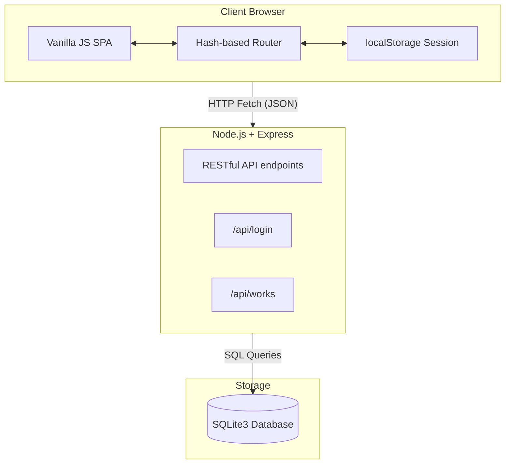

# 🏛️ NNMV Development Works Dashboard

<p align="center">
  
</p>


A centralized, responsive, and secure monitoring system designed for the **Nagar Nigam Mathura-Vrindavan (NNMV)**. This platform enables local officials, Junior Engineers (JEs), and Councillors to track, update, and audit municipal development projects (e.g., roads, pipelines, drainage) in real-time.

---

## 📜 Project Background & Original Requirements

This dashboard was developed to solve the following administrative requirements mandated by the Nagar Nigam Mathura-Vrindavan:

> **विषय:** नगर निगम के विकास कार्यों हेतु Development Works Monitoring Dashboard विकसित करने के संबंध में
> 
> नगर निगम मथुरा-वृंदावन की वेबसाइट पर एक Centralized Development Works Monitoring Dashboard विकसित किया जाना है, जिसमें नगर निगम द्वारा कराए जा रहे सभी विकास एवं निर्माण कार्यों को एक ही Dashboard पर मॉनिटर किया जा सके।
> 
> **वित्तीय स्रोत / योजनाएं (Financial Sources):**
> - 15वां केंद्रीय वित्त आयोग (15th Finance Commission)
> - राज्य वित्त आयोग (State Finance Commission – SFC)
> - नगर निगम की स्वयं की आय/नगर निगम निधि
> - केंद्र/राज्य सरकार की विभिन्न योजनाएं (स्वच्छ भारत मिशन, अमृत योजना, CM-GRIDS, सीवरेज एवं ड्रेनेज आदि)
> 
> **मुख्य आवश्यकताएं (Core Requirements):**
> - **Ward-wise Monitoring:** Ward-wise Development Works की जानकारी उपलब्ध हो।
> - **Councillor Access:** प्रत्येक पार्षद को Login ID/Password मिले, जिससे वे अपने वार्ड में चल रहे सभी कार्यों की स्थिति देख सकें।
> - **JE Access & Updates:** निर्माण विभाग के JE के लिए अलग Login हो, जिससे वे Progress अपडेट कर सकें। JE द्वारा प्रत्येक Progress Update के साथ फोटो, तारीख, Progress % एवं Remarks अपलोड करने की सुविधा हो।
> - **Milestone Tracking:** प्रत्येक कार्य के लिए Milestone/Stage-wise Progress की सुविधा हो (उदा: Road Work में Base तैयार → गिट्टी/रेत का कार्य → इंटरलॉकिंग → Finishing → कार्य पूर्ण)।
> - **Visual Proof:** कार्य की Before, Progress और Completion Photographs सुरक्षित रूप से प्रदर्शित हों।
> - **Global Dashboard:** Admin/Officer Dashboard में पूरे नगर निगम के कार्यों की Ward-wise, Department-wise एवं Scheme-wise Monitoring हो।
> - **Advanced Filtering:** Ward, Work Type, Scheme, Financial Source, Status, JE आदि के आधार पर Search एवं Filter की सुविधा।
> 
> **Reference Portals:**
> - `nnmv.online` (SFC एवं नगर निगम की निधि वाले कार्य)
> - `nnmvprojects.online` (केंद्र एवं स्टेट योजनाएं)
> 
> **उद्देश्य (Objective):**
> नगर निगम के सभी विकास कार्यों की जानकारी, उनकी वर्तमान स्थिति एवं Progress को एक ही Dashboard पर उपलब्ध कराना, ताकि अधिकारी, JE, पार्षद एवं आवश्यकता अनुसार नागरिक कार्यों की स्थिति आसानी से देख सकें।

### 💡 How This Platform Fulfills These Requirements

1. **Centralized Data & Ward-wise Monitoring**: 
   - We implemented a robust relational SQLite database that links every `Work` project directly to a `Ward`. This allows the `Ward Analytics` module to instantly filter and aggregate costs, milestones, and status by individual geographic wards (all 70 Wards across 4 Zones).
2. **Financial Sources & Schemes Tracking**: 
   - A dedicated `Schemes` table and `Scheme Analytics` view was built. Whether the funding is from the 15th Finance Commission, SFC, or CM-GRIDS, officers can filter the dashboard to track budget utilization per funding source.
3. **Role-Based Logins (Admin, Officer, JE, Councillor)**: 
   - The `/api/login` backend endpoint strictly enforces RBAC (Role-Based Access Control). 
   - **Councillors** are restricted to viewing only their assigned ward's progress.
   - **JEs** can only access, update, and modify the works assigned to their specific `jeId`.
   - **Admins & Officers** get the "Global Dashboard" view across the entire municipal area.
4. **Milestone Tracking & Visual Proof**: 
   - The frontend `WorksPage` includes a dynamic progress timeline (e.g., Base Prep → Sand Work → Interlocking) customized by the specific `workType` (Road vs Drainage).
   - JEs have an integrated upload interface to attach Before, Progress, and After photos for verifiable, date-stamped auditing.
5. **Advanced Filtering Engine**: 
   - The Works Management UI features live, combination-based filtering. Users can cross-reference multiple filters simultaneously (e.g., Show me all "In Progress" works, funded by "SFC", in "Ward 15", handled by "JE Rajesh").

---

## ✨ Key Features

- 🔐 **Secure Role-Based Access Control (RBAC)**: Tailored dashboard views for Super Admins, Municipal Officers, Junior Engineers, and Councillors.
- 📊 **Real-time KPI Tracking**: Instant insights into financial allocations, project statuses, and completion rates.
- 📱 **Mobile-First Responsive UI**: Seamlessly works on desktop, tablets, and smartphones for on-site field updates.
- 📈 **Dynamic Analytics**: Filter and visualize progress by Ward, Scheme, Department, and Contractor.
- 🗄️ **Robust Local Database**: Powered by SQLite for reliable, file-based data persistence.

---

## 📊 Dashboard Modules & Reporting

The application is broken down into several functional pages (modules), each designed to provide specific reports and insights to municipal stakeholders:

### 1. Global KPI Dashboard
- **What it is:** The main landing page showing high-level metrics (Total Sanctioned Amount, Overall Progress, Works by Status).
- **How it helps:** Gives Municipal Officers and the Mayor a 10,000-foot view of the city's development health at a single glance.

### 2. Works Management
- **What it is:** A detailed, searchable, and filterable table of every single development project in the city.
- **How it helps:** Allows Junior Engineers (JEs) to quickly find their assigned projects, update progress percentages, upload site photos, and change completion statuses.

### 3. Ward Analytics
- **What it is:** A geographic breakdown of development works filtered by specific Wards.
- **How it helps:** Councillors can see exactly how much budget is being spent in their specific ward, preventing uneven development and ensuring their constituents' needs are met.

### 4. Scheme Analytics
- **What it is:** Reports categorized by funding schemes (e.g., AMRUT, Smart City, Swachh Bharat).
- **How it helps:** Ensures that state and federal grants are being utilized effectively and helps track compliance with scheme-specific milestones and deadlines.

### 5. Department Analytics
- **What it is:** Performance tracking across internal municipal departments (Civil Construction, Water Supply, Drainage).
- **How it helps:** Identifies bottlenecks. If the Drainage department has 80% of its works "Delayed", management can immediately allocate more resources or investigate the delays.

### 6. Audit & Activity Logs
- **What it is:** A chronological feed of every action taken in the system (e.g., "JE Rajesh updated progress to 65%").
- **How it helps:** Ensures absolute accountability and transparency. It prevents fraudulent updates by permanently logging who changed what, and when.

---

## 🛠️ Architecture & Tech Stack

The application utilizes a lightweight, decoupled architecture, allowing the frontend Single Page Application (SPA) to securely communicate with the backend REST API.



### 📦 Technologies
- **Frontend**: HTML5, CSS3 (Native CSS Variables), Vanilla JavaScript.
- **Backend**: Node.js, Express.js.
- **Database**: SQLite3.
- **Icons**: [HugeIcons](https://hugeicons.com/)

---

## 🚀 Comprehensive Setup Guide

Follow these step-by-step instructions to get the municipal dashboard running on your local machine.

### Prerequisites
- [Node.js](https://nodejs.org/en/) (v16.x or higher)
- NPM (Node Package Manager) - installed automatically with Node.js.

### 1. Clone the repository
Navigate to your desired folder and ensure all files are downloaded.

### 2. Install dependencies
```bash
npm install
```

### 3. Initialize & Seed the Database
The project comes with a seed script that automatically configures the database schema and injects initial municipal mock data.
```bash
node seed.js
```
*Expected Output: `Database seeded successfully!`*

### 4. Start the Application
Run the backend Express server, which also statically serves the frontend application.
```bash
npm start
```
*Expected Output: `Server running at http://localhost:3000`*
*(If port 3000 is in use, you may need to stop other services or change the port in `server.js`)*

### 5. Access the Dashboard
Open your web browser and navigate to:
**👉 http://localhost:3000**

---

## 🔑 Default Login Credentials

Use the following credentials to explore the different permission levels within the dashboard:

| Role Level | Username | Password | Access Rights |
| :--- | :--- | :--- | :--- |
| **Super Admin** | `admin` | `admin123` | Full access to all analytics, wards, schemes, and user actions. |
| **Municipal Officer** | `officer` | `officer123` | Read-only global monitoring and auditing capabilities. |
| **Junior Engineer (JE)** | `je001` | `je123` | Can update progress, add photos, and modify assigned works only. |
| **Councillor** | `coun15` | `coun123` | Restricted to viewing works and analytics for their specific ward. |

---

## 📁 Project Structure

```text
muncipal-dashboard/
├── css/
│   ├── base.css           # Typography, resets, and utility classes
│   ├── components.css     # Buttons, forms, tables, modals
│   ├── dashboard.css      # KPI cards, charts, layout specifics
│   ├── layout.css         # Sidebar, header, responsive shell
│   └── variables.css      # Design tokens (colors, spacing, fonts)
├── js/
│   ├── app.js             # Application initialization & event bindings
│   ├── auth.js            # Login handling & API authentication
│   ├── data.js            # Data fetching & state hydration
│   ├── router.js          # Client-side hash routing engine
│   └── ... (Page controllers)
├── server.js              # Express backend API & static server
├── seed.js                # Database initialization script
├── database.sqlite        # Generated SQLite database (after running seed.js)
├── package.json           # Node.js dependencies
└── index.html             # Main entry point (App Shell)
```

---

## 🧩 Module Details

### Frontend Architecture (`/js`)
- **`app.js`**: The main entry point for the frontend. It initializes the application, registers all client-side routes with the custom router, sets up global event listeners (like sidebar toggles and notification dropdowns), and checks for active user sessions on startup.
- **`auth.js`**: Manages user authentication. It intercepts the login form submission, sends a secure POST request to the backend `/api/login` endpoint, and stores the authenticated user profile in `localStorage`. It also handles dynamic role-based UI adjustments (e.g., hiding restricted sidebar links).
- **`data.js`**: The core data hydration layer. It fetches raw relational data from the backend SQLite database and maps those flat rows into rich, nested JavaScript objects (linking works to their respective wards, schemes, and departments) so the UI components can render them seamlessly.
- **`router.js`**: A lightweight, custom hash-based router. It listens for URL hash changes (e.g., `#dashboard`, `#works`) and dynamically injects the appropriate page templates into the main content container without requiring a full page reload.

### Design System (`/css`)
- **`variables.css`**: The single source of truth for the design system. It contains CSS custom properties (variables) for the municipal color palette (Deep Blue, Teal, Green), typography, spacing, and shadows, ensuring WCAG 2.1 AA accessibility compliance.
- **`dashboard.css`**: Contains specific styles for the high-level dashboard views, including the solid-color KPI metric cards and analytical layouts.
- **`layout.css` & `responsive.css`**: Manages the structural layout of the application, including the mobile-responsive sidebar navigation (with overlay), the top header bar, and the main content area grids.

### Backend & Storage (`/server.js` & `/seed.js`)
- **`server.js`**: The Node.js Express server. It serves two main purposes: (1) Statically serving the frontend HTML/CSS/JS files, and (2) Exposing REST API endpoints (`/api/login`, `/api/works`, etc.) that query the SQLite database and return JSON data to the client.
- **`seed.js`**: A database initialization script. When executed, it drops/creates the SQLite database file (`database.sqlite`), defines the table schemas (Wards, Works, Users), and populates them with initial mock data so the dashboard is immediately usable out-of-the-box.

---

> **Note on Security:** 
> The current setup utilizes plaintext passwords and `localStorage` for session management to facilitate easy local development and demonstration. For a production environment, ensure to implement `bcrypt` for password hashing and secure HttpOnly cookies for session management.

---

## 📝 Presentation / Slide Content (For PPT Generation)

*If you are building a PowerPoint presentation for this project, you can copy-paste the structured text below directly into your slides.*

### Slide 1: Introduction & Objective
- **Project Name:** NNMV Centralized Development Works Monitoring Dashboard.
- **Objective:** To bring 100% transparency, speed, and accountability to municipal construction and development works across all 70 Wards.
- **Goal:** Move away from scattered Excel sheets and informal WhatsApp updates to a single, unified digital platform accessible by all stakeholders.

### Slide 2: The Core Problem
- **Lack of Centralized Tracking:** Difficult to know the exact status of works funded by different sources (SFC, 15th FC, CM-GRIDS).
- **Delayed Reporting:** Field updates from JEs took days to reach the head office, causing delays in financial approvals.
- **Geographic Imbalance:** Hard for Councillors to visually track if their specific wards were getting fair development funds.
- **Audit Deficits:** Lack of structured visual proof (Before/After photos) tied directly to financial milestones.

### Slide 3: Project Mandate & Requirements
- **Financial Segregation:** Must track funds from 15th FC, SFC, NN Fund, AMRUT, and SBM separately.
- **Strict Role Boundaries:** Councillors must only see their wards; JEs must only update their assigned works.
- **Granular Progress:** Cannot just use "In Progress." Must track stage-by-stage (e.g., Base → Sand → Interlocking).
- **Consolidation:** Replace the multiple older portals (`nnmv.online`, `nnmvprojects.online`) with one unified, modern system.

### Slide 4: The Dashboard Solution
- **Real-Time KPI Tracking:** Live cards showing Sanctioned Amounts vs. Completed Works at the top of the dashboard.
- **Mobile-First Field Updates:** UI is designed as a web-app so JEs can upload progress percentages and site photos directly from their smartphones on-site.
- **Advanced Filtering Engine:** Cross-reference data by Ward, Department, Scheme, and Status in seconds to generate instant reports.

### Slide 5: Role-Based Access Control (RBAC)
- **Super Admins & Officers (Nagar Ayukt):** 360-degree global view of all 70 Wards across 4 Zones. High-level financial auditing and bottleneck identification.
- **Junior Engineers (JEs):** Write-access restricted strictly to their assigned works. Can update milestones and upload photographic evidence.
- **Councillors:** Read-only access geographically locked to their specific Ward. Fosters local trust and prevents misinformation about budget allocation.

### Slide 6: Milestone & Visual Tracking
- **Stage-wise Progress:** Standardized timelines customized by project type (e.g., Road Construction vs. Drainage Setup).
- **Photographic Evidence:** Mandatory photo uploads for *Before*, *In-Progress*, and *Completion* stages to prevent ghost-projects.
- **Chronological Audit Logs:** The system permanently records "Who changed What and When," completely eliminating fraudulent back-dating.

### Slide 7: Technical Architecture
- **Frontend Stack:** Ultra-fast, lightweight Vanilla JavaScript (ES6+), HTML5, and Custom CSS3 Variables. Ensures compatibility on older government devices.
- **Backend Stack:** Node.js runtime with Express.js REST API.
- **No-Reload SPA:** Hash-based routing ensures the dashboard feels like a native mobile app without page reloads, saving bandwidth.

### Slide 8: Database & Storage Strategy
- **SQLite3 Database:** Uses a highly reliable, file-based relational database.
- **Why SQLite?:** Requires zero configuration, is highly portable, and is more than capable of handling municipal-scale data (thousands of works) with blazing fast read-times.
- **Data Hydration:** Flat SQL rows are instantly mapped into rich nested JS objects for seamless UI rendering.

### Slide 9: Impact & Business Value
- **10x Faster Reporting:** Status updates go from the field to the Mayor's desk in seconds instead of days.
- **Zero Ambiguity:** Photographic proof linked to exact timestamps ensures contractors are only paid for verified work.
- **Data-Driven Governance:** Officers can instantly see which departments or zones are underperforming and reallocate resources.

### Slide 10: Future Scope & Enhancements
- **Interactive GIS Map View:** Plotting all construction works on a digital map using GPS coordinates for spatial analysis.
- **Public Citizen Portal:** A read-only link for citizens to check development works in their area, boosting public trust.
- **Automated Alerts:** WhatsApp or SMS notifications sent to officers when a project exceeds its target completion date.
- **One-Click Exports:** Direct exports of filtered tables to PDF and Excel for physical committee meetings.
