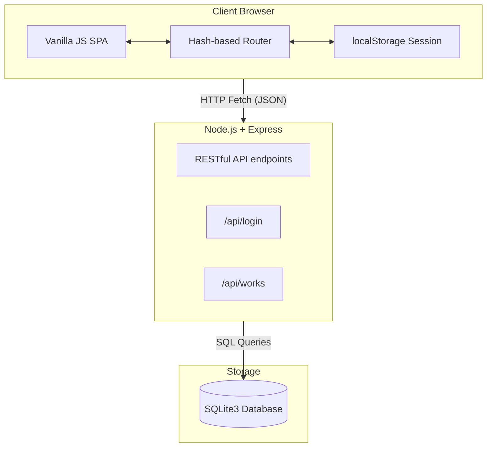

# 🏛️ NNMV Development Works Dashboard

<p align="center">
  
</p>


A centralized, responsive, and secure monitoring system designed for the **Nagar Nigam Mathura-Vrindavan (NNMV)**. This platform enables local government officials, Junior Engineers (JEs), and Councillors to track, update, and audit municipal development projects (e.g., roads, pipelines, drainage) in real-time.

---

## ✨ Key Features

- 🔐 **Secure Role-Based Access Control (RBAC)**: Tailored dashboard views for Super Admins, Municipal Officers, Junior Engineers, and Councillors.
- 📊 **Real-time KPI Tracking**: Instant insights into financial allocations, project statuses, and completion rates.
- 📱 **Mobile-First Responsive UI**: Seamlessly works on desktop, tablets, and smartphones for on-site field updates.
- 📈 **Dynamic Analytics**: Filter and visualize progress by Ward, Scheme, Department, and Contractor.
- 🗄️ **Robust Local Database**: Powered by SQLite for reliable, file-based data persistence.

---

## 🛠️ Architecture & Tech Stack

The application utilizes a lightweight, decoupled architecture, allowing the frontend Single Page Application (SPA) to securely communicate with the backend REST API.



### 📦 Technologies
- **Frontend**: HTML5, CSS3 (Native CSS Variables), Vanilla JavaScript.
- **Backend**: Node.js, Express.js.
- **Database**: SQLite3.
- **Icons**: [HugeIcons](https://hugeicons.com/)

---

## 🚀 Comprehensive Setup Guide

Follow these step-by-step instructions to get the municipal dashboard running on your local machine.

### Prerequisites
- [Node.js](https://nodejs.org/en/) (v16.x or higher)
- NPM (Node Package Manager) - installed automatically with Node.js.

### 1. Clone the repository
Navigate to your desired folder and ensure all files are downloaded.

### 2. Install dependencies
```bash
npm install
```

### 3. Initialize & Seed the Database
The project comes with a seed script that automatically configures the database schema and injects initial municipal mock data.
```bash
node seed.js
```
*Expected Output: `Database seeded successfully!`*

### 4. Start the Application
Run the backend Express server, which also statically serves the frontend application.
```bash
npm start
```
*Expected Output: `Server running at http://localhost:3000`*
*(If port 3000 is in use, you may need to stop other services or change the port in `server.js`)*

### 5. Access the Dashboard
Open your web browser and navigate to:
**👉 http://localhost:3000**

---

## 🔑 Default Login Credentials

Use the following credentials to explore the different permission levels within the dashboard:

| Role Level | Username | Password | Access Rights |
| :--- | :--- | :--- | :--- |
| **Super Admin** | `admin` | `admin123` | Full access to all analytics, wards, schemes, and user actions. |
| **Municipal Officer** | `officer` | `officer123` | Read-only global monitoring and auditing capabilities. |
| **Junior Engineer (JE)** | `je001` | `je123` | Can update progress, add photos, and modify assigned works only. |
| **Councillor** | `coun15` | `coun123` | Restricted to viewing works and analytics for their specific ward. |

---

## 📁 Project Structure

```text
muncipal-dashboard/
├── css/
│   ├── base.css           # Typography, resets, and utility classes
│   ├── components.css     # Buttons, forms, tables, modals
│   ├── dashboard.css      # KPI cards, charts, layout specifics
│   ├── layout.css         # Sidebar, header, responsive shell
│   └── variables.css      # Design tokens (colors, spacing, fonts)
├── js/
│   ├── app.js             # Application initialization & event bindings
│   ├── auth.js            # Login handling & API authentication
│   ├── data.js            # Data fetching & state hydration
│   ├── router.js          # Client-side hash routing engine
│   └── ... (Page controllers)
├── server.js              # Express backend API & static server
├── seed.js                # Database initialization script
├── database.sqlite        # Generated SQLite database (after running seed.js)
├── package.json           # Node.js dependencies
└── index.html             # Main entry point (App Shell)
```

---

> **Note on Security:** 
> The current setup utilizes plaintext passwords and `localStorage` for session management to facilitate easy local development and demonstration. For a production environment, ensure to implement `bcrypt` for password hashing and secure HttpOnly cookies for session management.
